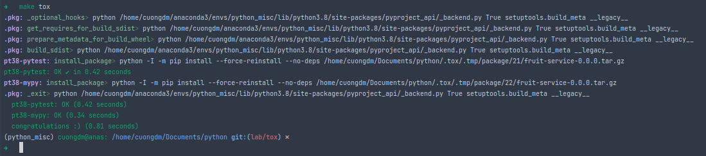
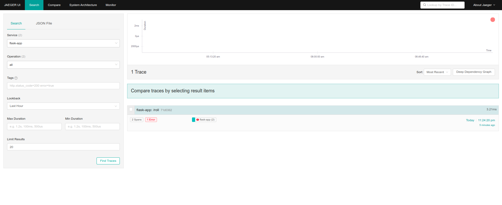
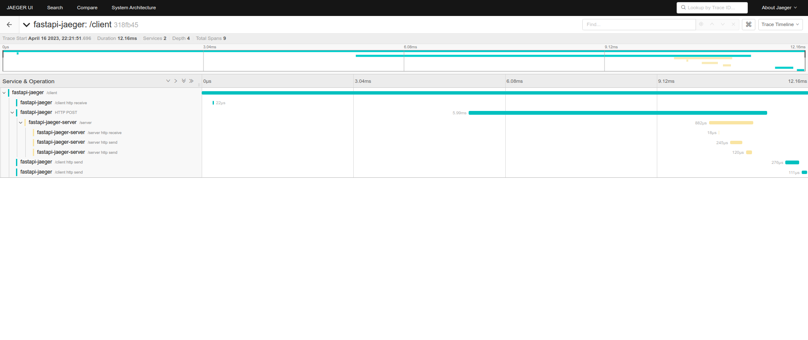
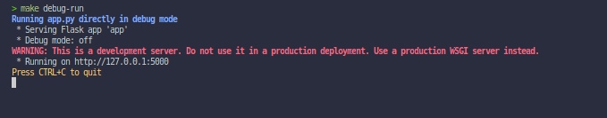
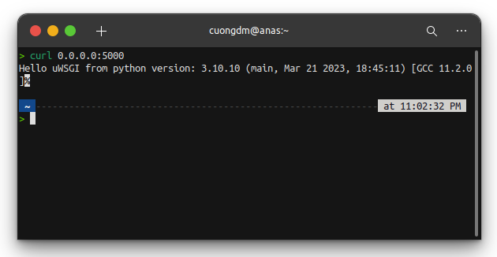

###### References:
- Guideline - [https://riptutorial.com/flask/example/16286/using-uwsgi-to-run-a-flask-application](https://riptutorial.com/flask/example/16286/using-uwsgi-to-run-a-flask-application)

###### Brief:
* This guildeline teach you how to run Flask application with uWSGI.

# 1. Environment
* Python 3.10.10, using Anaconda to create the virtual environment.
  ```bash
  conda create -n flask-uwsgi python=3.10 pip  
  ```

# 2. Demo
## 2.1. Using `uwsgi`
* Run the Flask application on the port 5000:
  ```bash
  make normal-run
  ```
  
* Call the API using `curl` command:
  ```bash
  curl 0.0.0.0:5000
  ```
  

## 2.2. Using `uwsgi` with the configuration file `uwsgi.ini`
* Run the Flask application on the port 9090:
  ```bash
  make filed-run
  ```
  
* Call the API using `curl` command:
  ```bash
  curl 0.0.0.0:9090
  ```
  

## 2.3. Directly run to debug
* Run the Flask application on the default port 5000:
  ```bash
  make debug-run
  ```
  
* Call the API using `curl` command:
  ```bash
  curl 0.0.0.0:5000
  ```
  
  