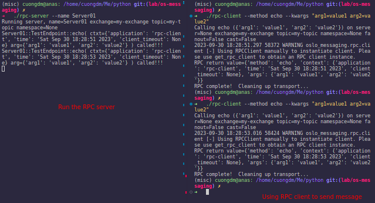
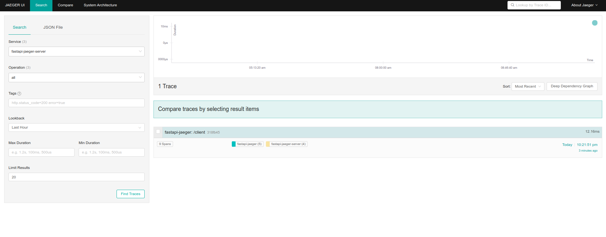

###### References
- CSDN - [https://blog.csdn.net/weixin_36179862/article/details/123485035](https://blog.csdn.net/weixin_36179862/article/details/123485035)

###### Brief
- Using OpenTelemetry and Jaeger in microservices.

###### Guideline 
- Run Jaeger inside the Docker container.
  ```bash
  docker run -d --name jaeger \
    -e COLLECTOR_ZIPKIN_HTTP_PORT=:9411 \
    -p 5775:5775/udp \
    -p 6831:6831/udp \
    -p 6832:6832/udp \
    -p 5778:5778 \
    -p 16686:16686 \
    -p 14250:14250 \
    -p 14268:14268 \
    -p 14269:14269 \
    -p 9411:9411 \
    jaegertracing/all-in-one:1.32
  ```
- Create the Python virtual environment:
  ```bash
  conda create -n opentelemetry python=3.8 pip
  ```
- Run the `fastapi-jaeger-server` and `fastapi-jaeger`:
  ```bash
  # terminal 1
  python service_01.py
  ```
  ```bash
  # terminal 2
  python service_02.py
  ```
  

- Send the request to `fastapi-jaeger`:
  ```bash
  curl -X 'POST' \
  'http://localhost:8000/client' \
  -H 'Accept: application/json' \
  -H 'Content-Type: application/json' \
  -d '{
    "userinfo": "Cloud Engineer at VNG",
    "name": "Cuong. Duong Manh"
  }'
  ```
  

- See the Jaeger UI to check the tracing results:
  - The result of `fastapi-jaeger` service: 
    
  - The result of `fastapi-jaeger-server` service:
    
  - Check the tracing with ID `318fb45`:
    